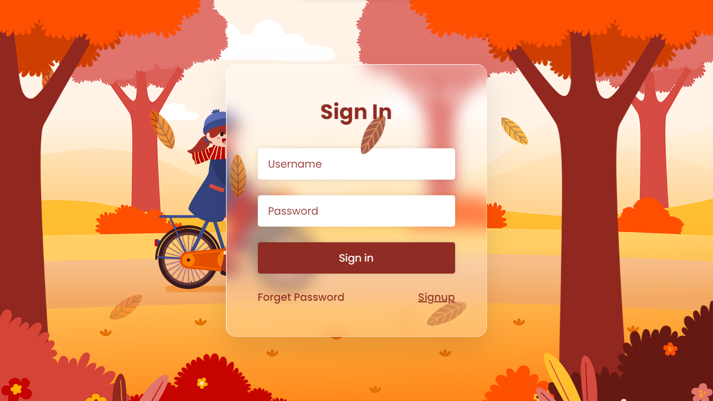

<div align="center">
    <h1> Sign - In</h1>
</div>



[Live Link](https://tajwarsaiyeed.github.io/sign-in-page-design)

```
sign-in-page
├─ bg.jpg
├─ girl.png
├─ index.html
├─ leaf_01.png
├─ leaf_02.png
├─ leaf_03.png
├─ leaf_04.png
├─ style.css
└─ trees.png

```
